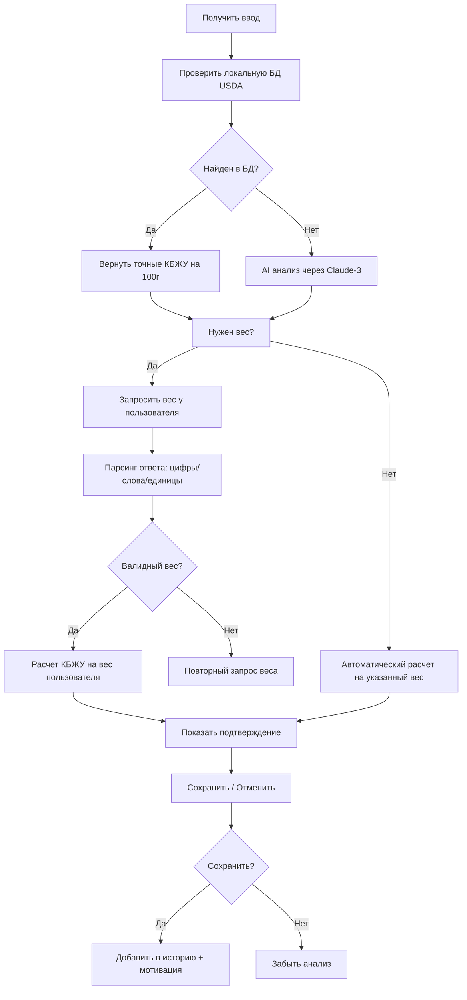
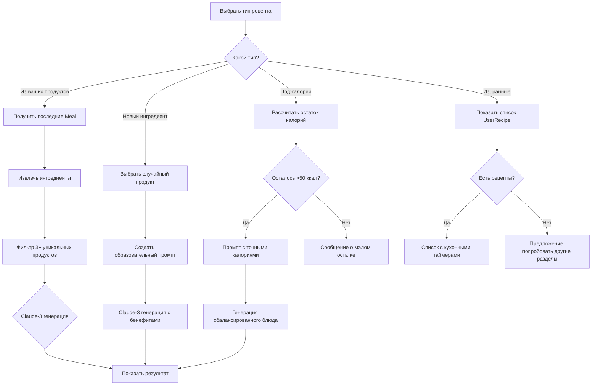

# 🌱 Eat_bot - Полное руководство по функционалу

## 📋 Оглавление
- [Общий бриф](#общий-бриф)
- [Основные возможности](#основные-возможности)
- [Пользовательские сценарии](#пользовательские-сценарии)
- [Полный User Flow](#полный-user-flow)
- [Команды и кнопки](#команды-и-кнопки)
- [Анализ продуктов](#анализ-продуктов)
- [Система рецептов](#система-рецептов)
- [Статистика и прогресс](#статистика-и-прогресс)
- [Технические особенности](#технические-особенности)

---

## 🎯 Общий бриф

**Eat_bot** - это интеллектуальный Telegram-бот для отслеживания питания и получения персонализированных рекомендаций по здоровому питанию.

### Основная цель
Помочь пользователям:
- ✅ Отслеживать ежедневное питание и калории
- ✅ Анализировать продукты через фото и текст
- ✅ Получать персонализированные рецепты
- ✅ Поддерживать здоровые пищевые привычки
- ✅ Знакомиться с новыми полезными продуктами

### Целевая аудитория
- Люди, следящие за здоровьем и фигурой
- Спортсмены и активные люди
- Родители, заботящиеся о правильном питании семьи
- Все, кто хочет питаться осознанно и вкусно

### Ключевые преимущества
- 🎯 **Персонализация** - учет возраста, пола, веса, активности
- 🤖 **ИИ-анализ** - распознавание продуктов через Claude-3/Anthropic
- 📱 **Простота** - удобный интерфейс в Telegram
- 📊 **Аналитика** - детальная статистика питания
- 🍳 **Рецепты** - AI-генерированные блюда по предпочтениям

---

├─────────────────┤
│  МЕНЮ НАСТРОЕК  │
├─────────────────┤

---

## ⚙️ Меню настроек (Settings)

### Упрощенная иерархия меню настроек

```
⚙️ Настройки
├── 👤 Профиль
│   ├── ⚖️ Изменить вес
│   ├── 📏 Изменить рост
│   ├── 🏃‍♂️ Уровень активности
│   ├── 🎂 Изменить возраст
│   └── ♂️♀️ Изменить пол
├── 🎯 Питание
│   ├── ⚡ Калории в день
│   ├── 🧬 Белки (г)
│   ├── 🥑 Жиры (г)
│   ├── 🍞 Углеводы (г)
│   ├── 🎯 Главная цель
│   └── 🔄 Пересчитать всё
├── 🔔 Уведомления
│   ├── ✅ Включить
│   └── ❌ Отключить
└── ⭐ Предпочтения
    ├── ❤️ Любимые продукты
    └── 👎 Нелюбимые продукты
```

### User Flow настроек

```mermaid
flowchart TD
    A[⚙️ Настройки] --> B{Выбор категории}

    B --> C[👤 Профиль]
    B --> D[🎯 Питание]
    B --> E[🔔 Уведомления]
    B --> F[⭐ Предпочтения]

    C --> G{Что изменить?}
    G --> H[Вес: запрос числа] --> I[Парсинг + валидация] --> J[Сохранение + пересчет целей]
    G --> K[Рост: запрос числа] --> L[Парсинг + валидация] --> M[Сохранение + пересчет целей]
    G --> N[Активность: выбор уровня] --> O[high|medium|low] --> P[Пересчет BMR]
    G --> Q[Возраст: запрос числа] --> R[Парсинг 10-120] --> S[Пересчет всех целей]
    G --> T[Пол: меню выбора] --> U[male|female|other]

    D --> V{Что настроить?}
    V --> W[Калории: ручной ввод] --> X[Валидация 500-5000]
    V --> Y[КБЖУ: ручное редактирование] --> Z[Проверка суммарных калорий]
    V --> AA[Цель: lose_weight|gain_muscle|maintain|health]
    V --> BB[🔄 Пересчитать] --> CC[Mifflin-St Jeor + корректировка по цели]

    E --> DD{Текущее состояние}
    DD --> EE[ВКЛ → Отключить] --> FF[stopUserScheduler]
    DD --> GG[ВЫКЛ → Включить] --> HH[startUserScheduler]

    F --> II[Управление предпочтениями в питании]
    II --> JJ[Любимые/нелюбимые продукты]
```

### Функции настройки профиля

#### Изменение параметров здоровья
- **Вес**: 30-300 кг с шагом 0.1 кг
- **Рост**: 100-250 см с шагом 1 см
- **Возраст**: 10-120 лет
- **Пол**: мужской/женский/другой
- **Активность**: низкий/средний/высокий

#### Расчет дневной нормы (Mifflin-St Jeor)
```javascript
function calculateBMR(user) {
  const { weight, height, age, gender } = user;
  if (gender === 'male') {
    return (10 * weight) + (6.25 * height) - (5 * age) + 5;
  } else {
    return (10 * weight) + (6.25 * height) - (5 * age) - 161;
  }
}

// Умножение на активность
const activityMultipliers = {
  low: 1.2,      // Сидячий образ жизни
  medium: 1.55,  // Умеренная активность
  high: 1.725    // Высокая активность
};
```

#### Корректировка по целям
```javascript
function adjustByGoal(baseCalories, goal) {
  switch(goal) {
    case 'lose_weight': return baseCalories - 500; // Дефицит
    case 'gain_muscle': return baseCalories + 300; // Избыток
    case 'health':      return baseCalories;        // Поддержание
    default:           return baseCalories;        // Поддержание
  }
}
```

### Распределение macronutrients

#### По целям питания
- **lose_weight**: 30% белки, 20% жиры, 50% углеводы
- **gain_muscle**: 35% белки, 25% жиры, 40% углеводы
- **maintain**: 25% белки, 25% жиры, 50% углеводы
- **health**: 25% белки, 30% жиры, 45% углеводы

#### Пересчет при изменении параметров
1. Рассчитывается базовый BMR
2. Применяется коэффициент активности
3. Корректируется по цели (дефицит/избыток)
4. Рассчитывается КБЖУ по процентам

### Управление уведомлениями

#### Автоматический планировщик
- **График уведомлений**:
  - 08:00 - Завтрак + мотивация утра
  - 13:00 - Обед + прогресс дня
  - 18:00 - Ужин + планы на вечер
  - 20:00 - Итоги дня + мотивация
- **Управление заданиями**: `startUserScheduler()` / `stopUserScheduler()`

#### Типы уведомлений
- **Завтрак**: "Доброе утро! Время для здорового завтрака 🌅"
- **Обед**: "Время обеда! Вы уже на X% от дневной нормы! 🍽️"
- **Ужин**: "Последний прием пищи дня. Контролируйте калории! 🌙"
- **Итоги**: "Отличный день! Вы выполнили XX% от целей! 🎉"

---

##  Основные возможности

### 1. Анализ продуктов
- **Текстовый анализ**: "курица гриль 200г", "банан", "паста карбонара 300г"
- **Фото анализ**: отправка фото еды → автоматическое распознавание
- **Голосовой ввод**: голосовые сообщения для анализа продуктов
- **Локальная БД**: 20k+ продуктов из USDA с переводом на русский
- **Адаптивный вес**: поддержка цифр ("200"), слов ("двести"), единиц ("200г")

### 2. Персональный трекинг
- **Дневные калории**: учет индивидуальной нормы по Mifflin-St Jeor
- **КБЖУ анализ**: белки/жиры/углеводы для каждого продукта
- **История приемов**: сохранение всех записей с timestamp
- **Цели питания**: похудение/набор/поддержание формы

### 3. AI-рекомендации
- **Рецепты из ваших продуктов**: использование уже съеденных ингредиентов
- **Знакомство с новыми продуктами**: суперфуды и полезные добавки
- **Под оставшиеся калории**: точные рецепты на остаток дневной нормы
- **Избранные рецепты**: персональная коллекция проверенных блюд
- **Сбалансированные блюда**: соотношение 30%/30%/40% КБЖУ

### 4. Статистика и аналитика
- **Дневная статистика**: /stats - полный отчет за день
- **Прогресс по целям**: сравнение с плановыми показателями
- **Мотивационные сообщения**: автоматические поздравления
- **Исторический анализ**: тренды питания за недели/месяцы

### 5. Удобный интерфейс
- **Русскоязычный**: полная локализация интерфейса
- **Inline клавиатуры**: удобная навигация без команд
- **Подтверждение действий**: возможность отмены/редактирования
- **Обратная связь**: понятные сообщения о действиях

---

## 👥 Пользовательские сценарии

### Сценарий 1: Новый пользователь
```
/start → Заполнение профиля → Изучение функционала
```

### Сценарий 2: Повседневное использование
```
🍽️ Добавить еду → [показать рецепт] → Проанализировать питание
```

### Сценарий 3: Планирование питания
```
📊 Статистика → 🍳 Рецепты → 📊 Под оставшиеся калории
```

### Сценарий 4: Изучение питания
```
🍳 Рецепты → 🆕 Новый ингредиент → ⭐ Добавить в избранное
```

### Сценарий 5: Контроль прогресса
```
/stats → Просмотр недельного тренда → Корректировка целей
```

---

## 🔄 Полный User Flow

```mermaid
flowchart TD
    A[/start\] --> B{Профиль заполнен?}
    B -->|Нет| C[Регистрация: возраст, пол, вес, рост]
    B -->|Да| D[Главное меню]

    C --> D

    D[Главное меню] --> E[🍽️ Добавить еду]
    D --> F[🍳 Рецепты]
    D --> G[📊 Статистика]
    D --> H[⚙️ Настройки]
    D --> I[📖 Помощь]

    E --> J{Как ввести?}
    J --> K[Текст: описание продукта]
    J --> L[📸 Фото еды]
    J --> M[🎤 Голосовое сообщение]

    K --> N{Найден в БД?}
    N -->|Да| O[Шаг 1: Автоматический анализ]
    N -->|Нет| P[Шаг 2: AI анализ через Claude]

    O --> Q{Вес указан?}
    P --> Q

    Q -->|Да| R[Показать подтверждение КБЖУ]
    Q -->|Нет| S[Запрос веса у пользователя]

    S --> T[Ввод: "200", "двести", "200г"]
    T --> R

    R --> U{Сохранить?}
    U -->|Да| V[Сохранить в историю]
    U -->|Нет| W[Отменить и забыть]

    V --> X[Показать обновленную статистику дня]
    V --> Y[Мотивационное сообщение от AI]

    F --> Z[Меню рецептов:
    🎯 Из ваших продуктов
    🆕 С новым ингредиентом
    ⭐ Мои избранные
    📊 Под оставшиеся калории]

    Z --> AA[Из ваших продуктов]
    Z --> BB[С новым ингредиентом]
    Z --> CC[Мои избранные]
    Z --> DD[Под оставшиеся калории]

    AA --> EE[Анализ последних приемов пищи]
    EE --> FF[Генерация рецепта из доступных ингредиентов]

    BB --> GG[Выбор случайного полезного продукта]
    GG --> HH[Генерация рецепта знакомства с новым продуктом]

    CC --> II{Есть избранные?}
    II -->|Да| JJ[Показать список рецептов]
    II -->|Нет| KK[Сообщение: попробуйте другие разделы]

    DD --> LL[Расчет остатка калорий: норма - съедено]
    LL --> MM{Осталось >50 ккал?}
    MM -->|Да| NN[Генерация сбалансированного рецепта]
    MM -->|Нет| OO[Сообщение: планируй на завтра]

    FF --> PP[Показать карточку рецепта]
    HH --> PP
    NN --> PP

    PP --> QQ[Карточка рецепта с КБЖУ и инструкциями]
    QQ --> RR[❤️/💔 Избранное]
    QQ --> SS[👀 Детали при клике на избранный]

    G --> TT[📊 Дневная статистика]
    TT --> UU[Показать:
    - Калории: съедено/норма/осталось
    - КБЖУ: белки/жиры/углеводы
    - Процент выполнения целей]

    H --> VV[Настройки]
    VV --> WW[Изменить цели]
    VV --> XX[Сменить норму калорий]
    VV --> YY[Вкл/выкл уведомления]

    I --> ZZ[📖 Помощь]
    ZZ --> AAA[Список команд]
    ZZ --> BBB[Примеры использования]
    ZZ --> CCC[Частые вопросы]
```

---

## 🎮 Команды и кнопки

### Основные команды
| Команда | Описание | Когда использовать |
|---------|----------|-------------------|
| `/start` | Начало работы с ботом | Первый запуск |
| `/stats` | Статистика питания за день | Проверка прогресса |
| `/help` | Справка и инструкции | Нужна помощь |
| `/settings` | Настройки профиля | Изменить данные |

### Кнопки главного меню
- **🍽️ Добавить еду** - ввод нового приема пищи
- **🍳 Рецепты** - меню с типами рецептов
- **📊 Статистика** - ежедневный отчет
- **⚙️ Настройки** - редактирование профиля
- **📖 Помощь** - инструкции и FAQ

### Кнопки анализа еды
- **Сохранить приём пищи** - добавить в дневной рацион
- **Отменить** - отказаться от сохранения
- **⭕ Отменить** - прервать уточнение продукта/веса

### Кнопки меню рецептов
- **🎯 Из ваших продуктов** - на основе съеденного
- **🆕 С новым ингредиентом** - знакомство с полезными продуктами
- **⭐ Мои избранные** - персональная коллекция
- **📊 Под оставшиеся калории** - точное соответствие остатку дня

### Кнопки карточки рецепта
- **❤️ В избранное** - сохранить рецепт для быстрого доступа
- **💔 Убрать из избранного** - удалить из коллекции
- **Ещё рецепт** - генерация нового рецепта с полезным продуктом

---

## 🔍 Анализ продуктов

### Поддерживаемые форматы ввода

#### Текстовый ввод
```
✅ курица гриль 200г
✅ 200г курицы
✅ салат овощной
✅ яблоко большое
❌ курица и салат (нужно по отдельности)
```

#### Голосовой ввод
- 🎤 Говорите естественным языком: *"Двести грамм курицы гриль"*
- 🎤 Поддержка уточнения веса: *"Курица двести грамм"*
- 🎤 Распознавание через Whisper AI

#### Фото анализ
- 📸 Отправьте фото еды
- 📸 Поддержка подписи: подпишите что на фото
- 📸 Vision AI через GPT-4 анализирует изображение
- 📸 Автоматическое определение продуктов и веса

### Алгоритм анализа



### Обработка веса

#### Поддерживаемые форматы
```
✅ 200          # просто цифры
✅ 200г         # с единицами измерения
✅ двести        # словами
✅ сто пятьдесят # сложные слова
✅ 200 килограмм # разные единицы (пересчет в граммы)
❌ две тысячи   # ограничение 5000г
```

#### Умный парсер веса
```javascript
function parseWeightText(text) {
  // 1. Ищем: число + единицы (г, кг, килограмм)
  // 2. Иначе: просто цифры ^(\d+(?:\.\d+)?)$
  // 3. Иначе: слова (один, двести, сто пятьдесят)
  // 4. Конвертация единиц в граммы
  // 5. Валидация диапазона 1-10000г
}
```

---

## 🍳 Система рецептов

### Типы рецептов

#### 1. 🎯 Из ваших продуктов
- **Алгоритм**: Анализ последних 50 приемов пищи
- **Извлечение**: Поиск повторяющихся ингредиентов
- **Генерация**: Рецепт от Claude-3 из доступных продуктов
- **Результат**: Персонализированное блюдо из съеденного

#### 2. 🆕 С новым ингредиентом
- **Алгоритм**: Случайный выбор из базы полезных продуктов
- **Продукты**: имбирь, куркума, чиа, брокколи, манго, фуа-гра и др.
- **Описание**: Почему продукт полезен + рецепт знакомства
- **Результат**: Образовательное блюдо + новая привычка

#### 3. ⭐ Мои избранные
- **Хранение**: SQLite база через модель UserRecipe
- **Отображение**: Список до 5 рецептов с временем приготовления
- **Управление**: Добавление/удаление через ❤️/💔
- **Результат**: Быстрый доступ к проверенным рецептам

#### 4. 📊 Под оставшиеся калории
- **Расчет**: `targetCalories` - `todaysNutrition.calories`
- **Валидация**: Минимум 50 ккал остатка
- **Генерация**: Целевой рецепт с точными КБЖУ
- **Баланс**: ~30% белки, ~30% жиры, ~40% углеводы

### Структура рецепта
```json
{
  "title": "Название блюда",
  "description": "Почему вкусно и полезно",
  "difficulty": "easy|medium|hard",
  "cooking_time": 25,
  "servings": 1,
  "ingredients": [
    {"name": "ингредиент", "amount": "количество", "unit": "г"}
  ],
  "instructions": "Пошаговый рецепт",
  "nutrition_per_serving": {
    "calories": 300,
    "protein": 25,
    "fat": 12,
    "carbs": 20
  },
  "tags": ["здоровое питание", "быстрое"]
}
```

### Алгоритм генерации



---

## 📊 Статистика и прогресс

### Дневная статистика
```
/stats или 📊 Статистика
```

**Показывает:**
- 🔢 **Калории**: съедено/план/остаток
- 🍗 **Белки**: текущие/рекомендованные
- 🧈 **Жиры**: текущие/баланс
- 🍞 **Углеводы**: текущие/запас энергии
- 📈 **Процент выполнения**: 75% от дневной нормы

### Расчет дневной нормы
```javascript
function calculateDailyCalories(user) {
  // Mifflin-St Jeor формула
  let bmr;
  if (gender === 'male') {
    bmr = (10 * weight) + (6.25 * height) - (5 * age) + 5;
  } else {
    bmr = (10 * weight) + (6.25 * height) - (5 * age) - 161;
  }

  // Умножение на активность
  const activityMultiplier = {
    low: 1.2,      // Сидячий образ жизни
    medium: 1.55,  // Умеренная активность
    high: 1.725    // Высокая активность
  };

  return Math.round(bmr * activityMultiplier[user.activityLevel]);
}
```

### Мотивационные сообщения

**Генерируются AI на основе прогресса:**
- "Отлично! Вы уже на 80% выполнили дневную норму белка! 💪"
- "Замечательно! Только 300 калорий осталось до цели дня! 🎯"
- "Продолжайте в том же духе! Ваше питание становится всё сбалансированнее! 🌱"

---

## 🔧 Технические особенности

### Архитектура бота

```
📁 /src
├── 🗃️ database/           # Sequelize модели и подключение
├── 🤖 bot/               # Основная логика телеграм-бота
├── 🎯 controllers/       # Бизнес-логика пользовательских сценариев
├── ⚙️ config/           # Конфигурация и константы
├── 🤖 services/         # Интеграция с внешними API
└── 🛠️ utils/             # Утилиты и хелперы

📁 /models               # Sequelize модели БД
📁 /migrations           # Миграции базы данных
📁 /docs                # Документация проекта
📁 /scripts             # Сервисные скрипты
```

### Используемые технологии

#### Backend & AI
- **Node.js** - основной runtime
- **Sequelize** - ORM для SQLite
- **Telegram Bot API** - интерфейс с Telegram
- **Claude-3 (Anthropic)** - AI для анализа и генерации
- **OpenRouter** - прокси для Claude API

#### База данных
- **SQLite** - локальная БД для хранения данных
- **USDA SR-28** - 20k+ продуктов с русским переводом
- **FoodData Central** - современные данные о питании

#### Мультимедиа
- **Whisper (OpenAI)** - транскрибация голосовых сообщений
- **GPT-4 Vision** - анализ фотографий продуктов

### Обработка ошибок

#### Graceful degradation
- Если AI недоступен → локальная БД
- Если Whisper недоступен → текстовый ввод
- Если Vision недоступен → текстовая альтернатива

#### Валидация данных
- КБЖУ значения: положительные числа ≤50000
- Вес продуктов: 1-10000г
- Калории дневные: по формулам, не >5000

#### Timeout защиты
- Уточнение продуктов/веса: 10 минут на ответ
- Pending состояния: автоматическая очистка

### Производительность

#### Оптимизации
- **Локальная БД**: быстрая индексированная БД вместо API запросов
- **Кеширование**: AI анализы сохраняются для повторных запросов
- **Асинхронность**: неблокирующие операции с AI
- **Парсинг**: оптимизированный анализ текста

#### Масштабируемость
- Модульная архитектура для легкого расширения
- Конфигурируемость AI моделей через config
- Поддержка множественных языков через JSON

---

## 🎉 Заключение

**Eat_bot** представляет собой полнофункциональную экосистему для осознанного питания с элементами искусственного интеллекта. Сочетание локальной базы данных, AI анализа и персонализированных рекомендаций делает бота мощным инструментом для поддержания здоровых пищевых привычек.

### Будущие улучшения
- 📱 Мобильное приложение
- 🤝 Социальные функции (обмен рецептами)
- 📈 Детальная аналитика трендов
- 🔔 Умные напоминания о приемах пищи
- 🌍 Поддержка новых языков

Бот готов к использованию в production среде и способен обрабатывать сотни одновременных пользователей благодаря эффективной архитектуре и локальной обработке данных.
